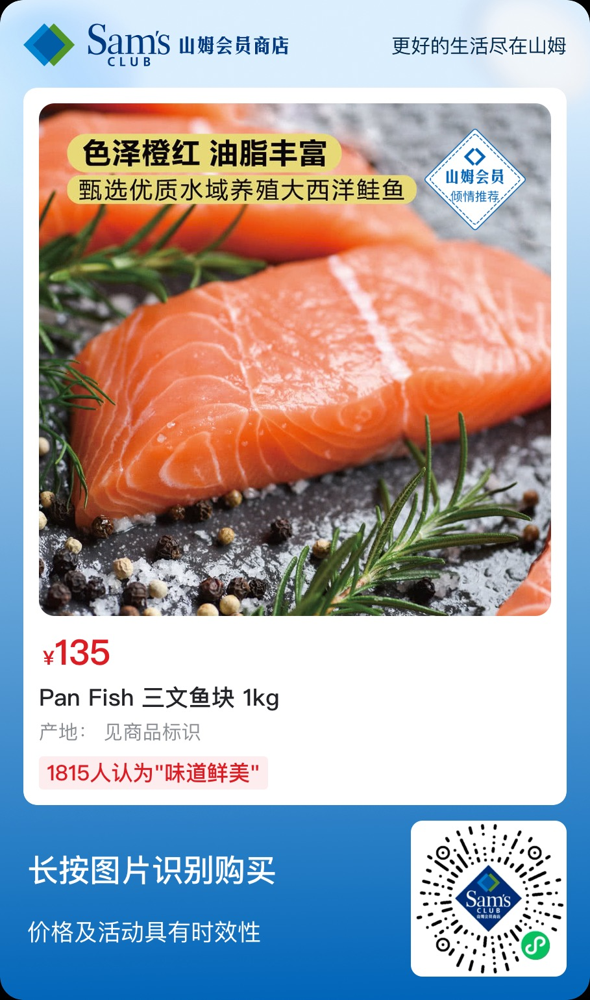
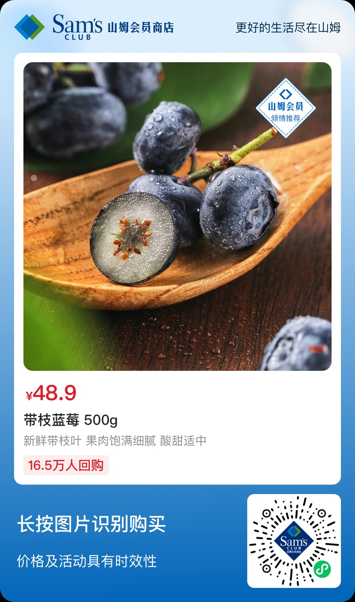
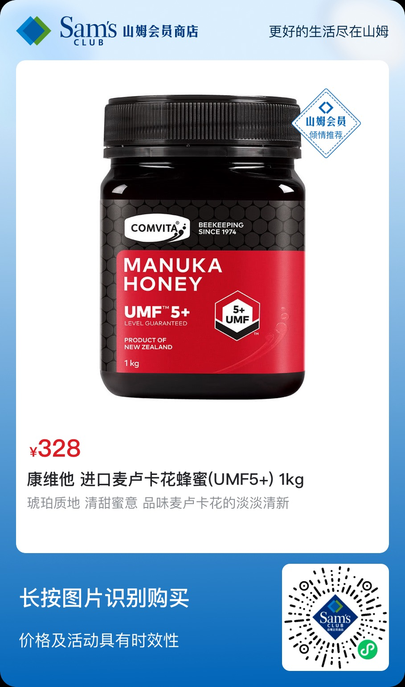

# 养生食物

## 蜂胶

### 康维他蜂胶胶囊（Propolis Capsules PFL 30）
#### 使用方法：每日1-2粒，随餐服用。
#### 购买渠道
>【淘宝】https://m.tb.cn/h.gSHLJ7yYviCr3nk?tk=T5Mk3b2LE5s MF1643 「澳大利亚直邮Comvita Bee Propolis PFL30 Veg Capsules 200mg 12」
点击链接直接打开 或者 淘宝搜索直接打开

### 康维他蜂胶喷雾（Propolis Oral Spray）
#### 购买渠道
>【京东】https://3.cn/2-20SuRQ 「康维他（comvita）蜂胶加强版口喷 口气清新剂喷雾 口腔喷雾20ml 新西兰进口 加强版【含20%麦卢卡蜂蜜】」 
点击链接直接打开

## 绿茶

### 西湖龙井
#### 品牌
* 西湖牌
* 贡牌

### 黄山毛峰
#### 品牌
* 谢裕大

### 洞庭碧螺春
#### 品牌
* 三万昌

### 太平猴魁
#### 品牌
* 猴坑牌

### 安吉白茶
#### 品牌
* 卢正浩

### 信阳毛尖
#### 品牌
* 韵潭牌

### 六安瓜片
#### 品牌
* 徽六

### 峨眉山雀舌
#### 品牌
* 秀岭淑茗

### 日照绿茶
#### 品牌
* 圣谷山

### 都匀毛尖
#### 品牌
* 贵天下

### 恩施玉露
#### 品牌
* 润邦芭蕉

### 崂山绿茶
#### 品牌
* 万里江

## 紫甘蓝
### 购买渠道
* 美团买菜

#### 食用方法：可做成沙拉、生吃或轻炒。

## 酸奶
#### 随便买

## 三文鱼

### 购买渠道
##### 山姆

#### 京东
>【京东】https://3.cn/220RuH-w 「美威【冰鲜】挪威三文鱼中段鱼肉刺身400g源头直发」 
点击链接直接打开

## 蓝莓
### 购买渠道
##### 山姆

## 蜂蜜
### 购买渠道
##### 山姆

